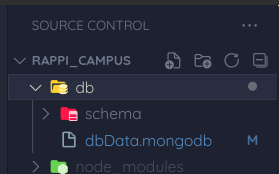
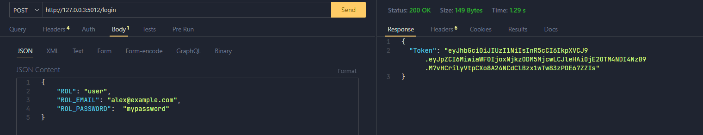
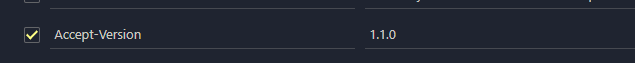

# **Rappi_Campus**

------

### Modelo


El modelo comercial principal de Rappi transmitía una economía colaborativa y, por lo tanto, se enfocaba en la ayuda mutua y la cooperación entre las empresas y sus clientes para garantizar el intercambio de bienes y servicios.

Rappi vinculó las necesidades de tres tipos de actores⎯consumidores, “correos Rappi” y aliados comerciales⎯en una plataforma tecnológica. Primero, los consumidores, que eran los clientes finales de Rappi, tenían dinero pero no disponible.

### 👀 IDEA

Usuarios estaban dispuestos a pagar por acceder a productos y servicios en la aplicación (app). En segundo lugar, los mensajeros de Rappi estaban a cargo de la distribución y mediaban entre aliados y consumidores. Al contrario de los consumidores, los mensajeros tenían tiempo pero necesitaban dinero. Finalmente, los aliados comerciales eran socios comerciales que comercializaban sus productos y servicios a través de la aplicación, la cual podían utilizar como canal de distribución.

### Como se enfoca en cada entorno de negocio

> 
>La recopilación y el análisis de datos que Rappi pudo realizar a partir de las transacciones realizadas a través de su plataforma le permitió a la empresa desarrollar soluciones adaptadas a los diferentes tipos de necesidades de los usuarios. Por ejemplo, los comentarios de sus clientes ayudaron a Rappi a comprender que ciertos usuarios no confiaban en el conocimiento de los mensajeros sobre las compras de comestibles. Esta situación motivó a Rappi a contratar asistentes en los puntos de venta (personal shopper) para ayudar a los mensajeros de Rappi en el proceso de compra
>
> Rappi impulsó la creación de cocinas escondidas, especializadas en la preparación de comidas para llevar. Estas cocinas se convertirían en una alternativa que permitiría a los aliados comerciales de Rappi aumentar significativamente las ventas y el ahorro de costos, ya que se podrían eliminar los salarios de los meseros y otros costos del servicio de restaurante
>
> **IMPORTANTE** : 
>
> Rappi no había utilizado estudios de mercado formales para desarrollar estas soluciones. Sin embargo, había priorizado la escucha activa con sus clientes a través de herramientas tecnológicas directamente incorporadas a la app. Esta técnica le permitió identificar de primera mano las preferencias de diferentes perfiles de usuarios, lo que le permitió modificar la oferta de la compañía.
>
> **Aspecto Común** : 
>
> Además de identificar las necesidades de los usuarios, estas soluciones tenían otro aspecto común, explicó
>Borrero, “Rappi conecta a personas con dinero pero sin tiempo, con personas con tiempo pero sin dinero;
> ayudamos a las personas a ahorrar tiempo ya dedicarse a actividades en las que generan más valor. Rappi es
> como un centro comercial virtual, reúne todo lo que hay cerca y te lo trae en minutos”.
> 
> Rappi exploró y abordó las diversas necesidades de los usuarios en lugar de centrarse en una sola demanda del cliente, a saber, los productos para llevar. Luego, avanzó en el desarrollo de la aplicación, con la esperanza de convertirse en una súper aplicación que integrara múltiples categorías comerciales.

### **SERVICIO DE RAPPI**

- Rappi (idea inicial)
- **RappiFavor**
- RappiMall
- RappiCash
- RappiViajes
- RappiApuestas (RappiBets)

### 👀 ¿Que es rappi favores?

> Rappi Favores es un servicio de Rappi que permite a los usuarios solicitar que otros hagan tareas por ellos. Las tareas pueden ser tan simples como recoger un paquete de la oficina de correos o tan complejas como hacer las compras de la semana.
>
> Para usar Rappi Favores, los usuarios deben abrir la aplicación Rappi y seleccionar la opción "Rappi Favores". Luego, pueden filtrar las tareas por ubicación, precio y tiempo. Una vez que encuentren una tarea que les interese, pueden tocar en "Solicitar" para enviar una solicitud.
>
> Los Rappitenderos son los usuarios que aceptan realizar tareas a través de Rappi Favores. Los Rappitenderos son evaluados por los usuarios y deben tener una calificación mínima de 4.5 estrellas para poder seguir trabajando.
>
> Una vez que un Rappitendero acepta una tarea, el usuario recibirá una notificación. El Rappitendero se comunicará con el usuario para acordar los detalles de la tarea. Una vez que la tarea esté completa, el usuario puede calificar al Rappitendero y pagar por el servicio.
>
> Rappi Favores es una excelente manera de obtener ayuda con las tareas que no tienen tiempo o no quieren hacer. Es también una excelente manera de ganar dinero si tiene tiempo libre y quiere hacer algo de dinero extra.
>
> Aquí hay algunos consejos para usar Rappi Favores:
>
> - Sea claro y conciso al describir la tarea que necesita ayuda.
> - Sea flexible con el tiempo.
> - Sea cortés y respetuoso con el Rappitendero.
> - Déle una buena calificación al Rappitendero si está satisfecho con el servicio.

### INFORMACION DEL PROYECTO

Esta documentación describe una aplicación similar a la de rappi_favores construida utilizando Node.js, Express.js y MongoDB como base de datos. La aplicación cuenta con un sistema de autenticación basado en roles y utiliza las librerías `dotenv`, `express-session`, `jose`, `MongoDB`, `nodemon`, `express-rate-limit`, `passport`, `passport-http-bearer`.

## Requisitos previos

- Node js instalado en tu maquina (Recomendada v18.16.0)

  - Instalación de Node usando NVM para Linux => nvm install v18.16.0

  - Instalación de Node usando NVM para Windows => https://github.com/coreybutler/nvm-windows

  - Verifica si se instaló correctamente:

    ```bash
    node -v
    npm -v
    ```

- MongoDB instalado y configurado con las credenciales necesarias para conectarse a la base de datos.

## Instalación

**Repositorio a clonar:**

```bash
https://github.com/davidRamirez1005/Rappi_campus
```

## Notas

1. **limitget** => para los metodos get y post:  La API tiene un limite de solicitudes que son de 4 por cada 10 segundos. Cuando se alcanza el límite de solicitudes establecido por `express-rate-limit` (4), el cliente recibirá un mensaje de error y no podrá realizar más solicitudes hasta que transcurra el período de ventana especificado (4s). Una vez que ha pasado el período de ventana, el contador se reinicia y el cliente podrá volver a realizar solicitudes normalmente.
2. **limitLogin** => para solicitar el token : La API tiene un limite de solicitudes que son de 3 por cada 3 segundos.


## Instrucciones

1. Descarga las dependencias y dependencias de desarrollo, usar: `npm i` o `npm update`

2. Una vez descargado nodejs y las dependencias crear el archivo **.env**, lo siguiente es la estructura que debe usar, tambien está en .env.example

   ```gherkin
   MY_SERVER={"hostname":"127.0.0.3", "port":5012}
   ATLAS_USER="user"
   ATLAS_PASSWORD="password"
   ATLAS_DB="db_campus_rappi"
   JWT_SECRET="jwt_secret"
   ```

3. iniciar nodemon que esta señalando a ./src/app.js : `npm run dev`

   El servidor debería iniciarse y estar listo para recibir solicitudes en la dirección 	`http://127.0.0.3:5012/` (puedes cambiar el puerto en el archivo `.env` si lo deseas).

4. Establezca conección a atlas en mongo, luego dirijase a la carpeta **db**, seleccione la carpeta schema y ejecute el archivo, luego dirijase al archivo 'db.mongodb' y ejecute el archivo

   

Una vez que observamos que el servidor esta activo y la base de datos instalada, procedemos a acceder a los router, sin embargo debemos generar el token antes por lo que procedemos:

#### **Ir el método POST **

Se debe generar el token según el rol al que queramos usar, dependiendo del nivel de autoridad prodremos acceder a ciertos routers.

```
http://127.0.0.3:5012/login
```

En la aplicación se definieron 3 roles

- user: el cual tiene acceso a las siguientes colecciones junto con sus versiones  y métodos colecciones 

-  ["task", "payment", "review","category"]

  ```js
  "task": {
  		"get": ["2.1.0", "3.1.0"],
  		"post": ["1.1.0"]
  	},
  	"payment":{
  		"get": ["1.1.0"]
  	},
  	"review":{
  		"get": ["2.1.0", "3.1.0"],
  		"post": ["1.1.0"]
  	},
  	"category":{
  		"get": ["2.1.0", "3.1.0"]
  	}
  ```

  ```json
  {
      "ROL": "user",
      "ROL_EMAIL": "alex@example.com",
      "ROL_PASSWORD":  "mypassword"
  }
  ```

  

- shopkeeper:  el cual tiene acceso a las siguientes colecciones junto con sus versiones  y métodos colecciones 

- ["task", "review", "payment"]

  ```js
  "task": {
  		"get": ["2.1.0", "3.1.0"],
  		"put": ["1.1.0"]
  	},
  	"payment":{
  		"get": ["1.1.0"]
  	},
  	"review":{
  		"get": ["2.1.0", "3.1.0"]
  	}
  }
  ```

  ```json
  {
      "ROL": "shopkeeper",
      "ROL_EMAIL": "sophie@example.com",
      "ROL_PASSWORD":  "sophie789"
  }
  ```

  

- Admin: el cual tiene acceso a todas las colecciones, versiones y métodos.

  ```json
  {
      "ROL": "admin",
      "ROL_EMAIL": "CJimenez21@example.com",
      "ROL_PASSWORD":  "admin2"
  }
  ```

  

  Esta informacion debe ir en el body de nuestra peticion dado que va a verificar en la base de datos si este usuario se encuentra registrado.



Si todo sale bien, esto nos dara una serie de caracteres, estos conforman nuestro token

Procedemos a copiar el token y a colocarlo en la parte de headers mas concretamente como "Authorization" y debemos escribir bearer antes de pegar el token, se deberia ver mas o menos asi:


Posteriormente nos dirigimos al endpoint al cual le queramos realizar una peticion y si el rol tiene permisos sobre el endpoint, accederá de lo contrario te arrojara que no estas autorizado para acceder a este recurso.

Cabe recalcar que el token cuenta con un tiempo de duración de 5 min despues de esto expirara y tendras que generar otro

Ahora también se debe especificar las versiones del endpoint que se esta manejando, para ello debemos establecer en los headers "Accept-Version" y se especifica la version a la cual se quiere acceder, se deberia ver mas o menos asi:



Si nuestro rol nos permite acceder a esta versión no dejara ingresar correctamente, de lo contrario nos negara el acceso a dicho endpoint con un mensaje como "This version is not allowed"

------


## **Endpoints y Métodos**

A continuación, se describen los endpoints disponibles en la aplicación junto con sus respectivos métodos HTTP y formatos de datos requeridos.

------

## Endpoint: *user*

**Versión**: 1.1.0

- #### POST -- *insertar un nuevo usuario*  => `/user/agregar`: 

  ```bash
  http://127.0.0.3:5012/user/agregar
  ```

  

  ```json
  {
      "username": "benito perez",
      "identification" : 1012114
      "email": "benito@example.com",
      "password": "benito123",
      "phone": "+578909809",
      "address": {
          "city": "bucaramanga",
          "street": "san francisco"
      },
      "registrationDate": "2023-08-27",
      "rol" : 2
  }
  ```

- #### DELETE -- *eliminar un usuario* => `/eliminar/user/2`: 

  ```
  http://127.0.0.3:5012/user/eliminar/2
  ```

  #### GET : ( use la version la necesaria)

  ```
  http://127.0.0.3:5012/user/listar
  ```

**Versión**: 1.1.0

- **GET** -- *obtener todos los usuarios que residen en bucaramanga*

**Versión**: 1.2.0

- **GET** -- *obtener todos los usuarios que se registraron antes de una fecha especifica* 

**Versión**: 2.0.0

- **GET** -- *obtener todos los pedidos que ha hecho un usuario por medio del nombre del usuario*

**Versión**: 2.1.0

- **GET** -- *obtener todos los usuarios que tienen pago pendiente*

**Versión**: 3.0.0

- **GET** -- *obtener todos los usuarios que tienen pago pendiente y residen en una ciudad en especifico*

**Versión**: 3.1.1

- **GET** --*obtener todos los usuarios que tienen pago pendiente y residen en una ciudad en especifico con descripcion del favor*

**Versión**: 3.2.0

- **GET** --*obtener la descripcion del favor completo por un usuario en especifico*

**Versión**: 3.3.1

- **GET** --*obtener la descripcion del favor completo por un usuario en especifico y el tendero que atendió el favor* 

------


## Endpoint: *Shopkeeper*

**Versión**: 1.1.0

- #### POST -- *insertar un nuevo tendero*  => `/shopkeeper/agregar`: 

  ```bash
  http://127.0.0.3:5012/shopkeeper/agregar
  ```

  

  ```json
  {
      "name": "pepito perez",
      "identification" : 96526
      "email": "pepito@example.com",
      "identification" : 202321
      "password": "pepito123",
      "phone": "+4567890345",
      "address": {
      "city": "bucaramanga",
      "street": "Calle Principal"
      },
      "availability": true,
      "rol" : 3
  }
  ```

- #### DELETE -- *eliminar un tendero* => `/eliminar/user/2`: 

  ```
  http://127.0.0.3:5012/shopkeeper/eliminar/2
  ```

  #### GET : ( use la version la necesaria)

  ```
  http://127.0.0.3:5012/shopkeeper/listar
  ```

**Versión**: 1.1.0

- **GET** -- *obtener todos los tenderos*

**Versión**: 1.2.0

- **GET** -- *obtener todos los tenderos con disponibilidad* 

**Versión**: 2.0.0

- **GET** -- *obtener todos los tenderos por medio del nombre*

**Versión**: 2.1.0

- **GET** -- *obtener todos los tenderos por medio de la cedula* => `http://127.0.0.3:5012/shopkeeper/listar/3`

------


## Endpoint: *Payment*

**Versión**: 1.1.0

- #### POST -- *Insertar un nuevo metodo de pago*  => `/payment/agregar`: 

  ```bash
  http://127.0.0.3:5012/payment/agregar
  ```

  

  ```json
  {
      "task_id": 7,
      "amount": 50000,
      "paymentDate": "2023-08-20",
      "paymentMethod": "nequi",
      "status": "aprobado"
  }
  ```


------


## Endpoint: *task*

**Versión**: 1.1.0

- ***Lista todas las tareas***

**Versión**: 2.1.0

- ***Lista todas las tareas Completadas***

**Versión**: 3.1.0

- ***Lista todas las tareas ordenadas por fecha y con su salida formateada***

 **GET**

```bash
http://127.0.0.3:5012/task
```

------

**Versión**: 1.1.0

- ***Lista las tareas por id***
- `http://127.0.0.3:5012/task/:id_task`

 **GET**

```bash
http://127.0.0.3:5012/task/3
```

**Versión**: 2.1.0

- ***Lista tareas según su estado y con salida formateada***
- Ten en cuenta que el estado debe corresponder a los definidos en la base de datos
- `http://127.0.0.3:5012/task/:estado`

 **GET**

```bash
http://127.0.0.3:5012/task/Solicitado
http://127.0.0.3:5012/task/Completado
http://127.0.0.3:5012/task/Asignado
```

**Versión**: 3.1.0

- ***Lista tareas realizadas un día en especifico y con su salida formateada***
- `http://127.0.0.3:5012/task/:fecha`

 **GET**

```bash
http://127.0.0.3:5012/task/2023-08-28
```

------

**Versión**: 1.0.0

- ***Inserta una nueva tarea***

```json
{
  "Titulo": "Transporte al aeropuerto",
  "Descripcion": "Necesito un conductor que me aeropuerto mañana temprano.",
  "Id_Usuario": 4,
  "Id_Tendero": 5,
  "Estado": "en Proceso",
  "Id_Categoria": 6,
  "Ciudad": "Bucaramanga",
  "direccion": "Avenida 89",
  "Id_Pago": 10
}
```

**POST**

```bash
http://127.0.0.3:5012/task
```

------

**Versión**: 1.0.0

- ***Actualizar el estado de una tarea***
- Ten en cuenta que el estado debe corresponder a los definidos en la base de datos

```json
{
  "Id_Tarea": 8,
  "Estado": "Completado"
}
```

**PUT**

```bash
http://127.0.0.3:5012/task
```

------


## Endpoint: *review*

**Versión**: 1.1.0

- ***Lista todas las reseñas***

**Versión**: 2.1.0

- ***Lista todas las reseñas con salida formateada***

**Versión**: 3.1.0

- ***Lista todas las reseñas con salida formateada y ordenadas de mas rankeadas a menos***

 **GET**

```bash
http://127.0.0.3:5012/review
```

------

**Versión**: 1.1.0

- ***Lista las reseñas por id***
- `http://127.0.0.3:5012/review/:id_review`

 **GET**

```bash
http://127.0.0.3:5012/review/6
```

**Versión**: 2.1.0

- ***Lista las reseñas por nombre de usuario con salida formateada***
- `http://127.0.0.3:5012/review/:Nombre_usuario`
- Ten en cuenta que el nombre de usuario debe corresponder a los definidos en la base de datos, eh aqui unos ejemplos

 **GET**

```bash
http://127.0.0.3:5012/review/alex Anonymous
http://127.0.0.3:5012/review/jose david ramirez
```

**Versión**: 3.1.0

- ***Lista  las reseñas por rating con salida formateada***
- `http://127.0.0.3:5012/review/:calificacion`

 **GET**

```bash
http://127.0.0.3:5012/review/5
```

------

**Versión**: 1.0.0

- ***Inserta una nueva reseña***

```json
{
  "Id_Tarea": 10,
  "Id_Usuario": 4,
  "Calificacion": 5,
  "Comentario": "Muy buen servicio, lo volverere a utilizar"
}
```

**POST**

```bash
http://127.0.0.3:5012/review
```

------


## Endpoint: *category*

**Versión**: 1.1.0

- ***Lista todas las categorías***

**Versión**: 2.1.0

- ***Lista todas categorías ordenadas alfabéticamente por nombre y con salida formateada***

**Versión**: 3.1.0

- ***Lista las categorías mas populares***

 **GET**

```bash
http://127.0.0.3:5012/category
```

------

**Versión**: 1.1.0

- ***Lista las categorías por id***

**Versión**: 2.1.0

- ***Lista las categorías por id pero con la salida formateada***

  **GET**

```bash
http://127.0.0.3:5012/category/1
```

------

**Versión**: 1.0.0

- ***Inserta una nueva categoria***

```json
 {
  "Nombre": "Servicio de cerrajeria",
  "Descripcion": "Este servicio consta de arreglar chapas, replicas de llaves, etc...",
  "Icono": "fas fa-lock"
}
```

**POST**

```bash
http://127.0.0.3:5012/category
```

------


Si tienes alguna pregunta o comentario sobre esta aplicación, no dudes en ponerte en contacto con nosotros a través dejosedavid.ramirez1005@gmail.com o  [cristianjj21@gmail.com](mailto:cristianjj21@gmail.com). ¡Esperamos que disfrutes usando nuestra aplicación de agendamiento de citas odontológicas!
